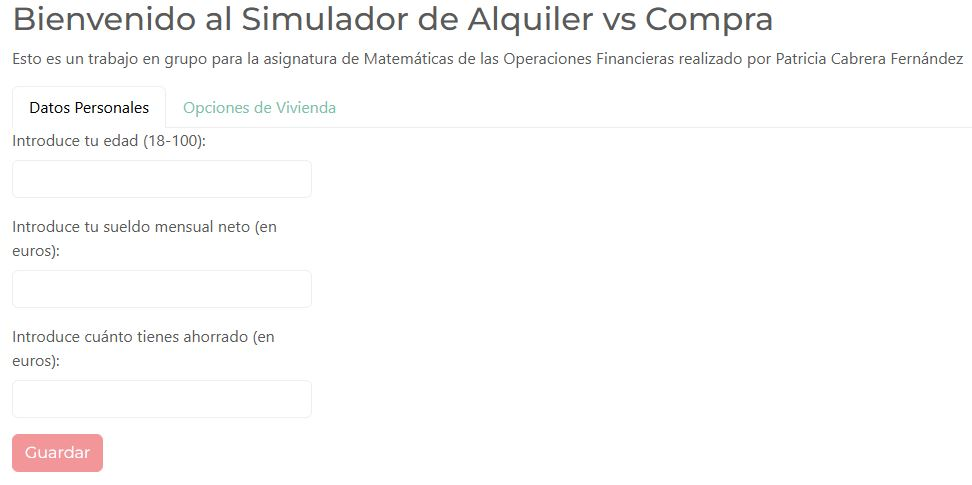
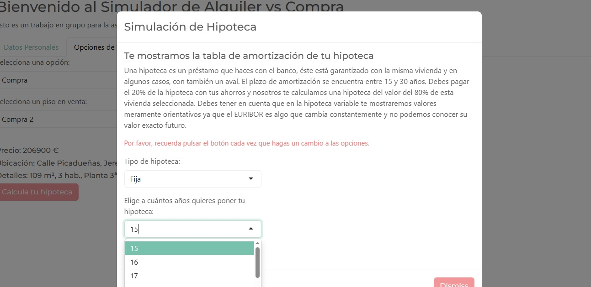
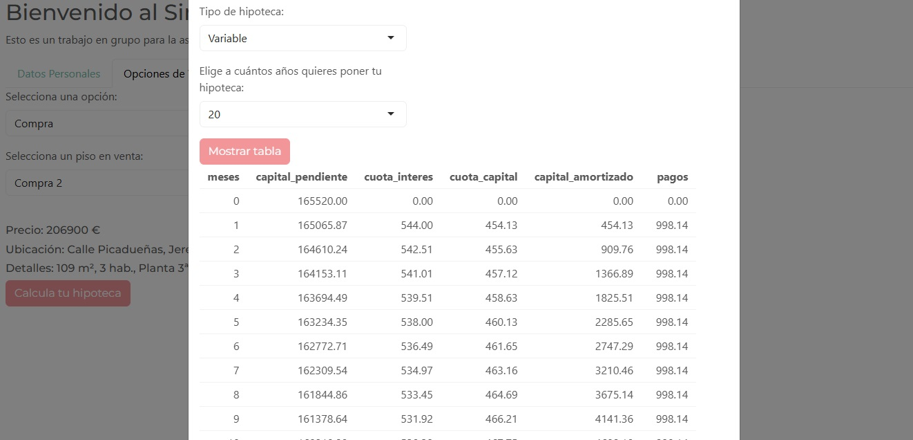

# Rent vs Buy Simulator in R (Shiny)

Academic project developed in R and Shiny to compare renting versus buying a property through financial simulation.

Features:
- Fixed-rate mortgage amortization model
- Variable-rate mortgage simulation using synthetic Euribor scenarios
- Interactive Shiny interface
- Housing affordability analysis based on salary and savings
- Real housing examples from Jerez de la Frontera

Built with:
- R
- Shiny
- Financial modeling
- Mortgage amortization methods (French system)

Highlights:
- Implementation of fixed and variable mortgage models
- Simulation of Euribor-driven mortgage scenarios
- Decision-support tool for rent vs buy analysis

## Simulator View

### Data Entry

### Mortgage Selection

### Mortgage Simulation

